# OBS Goldeneye Filter

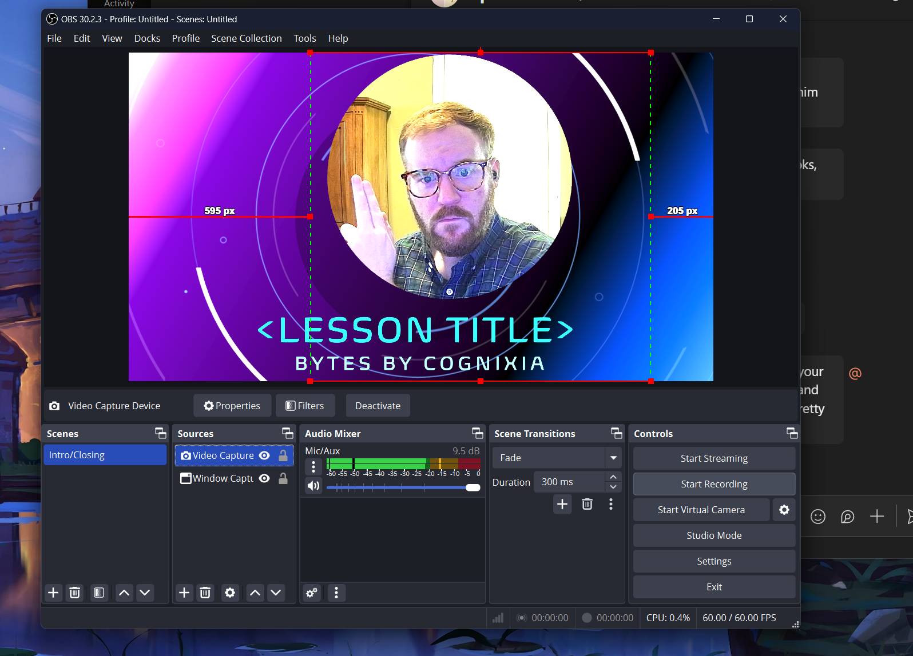

## Requirements:
1. Screen Recording Software/Application with PIP and Image-Mask capabilities. (OBS is reccomended)
    - [OBS Studio](https://obsproject.com/)
2. Powerpoint Slide Template ([goldeney.pptx](./goldeneye.pptx))
3. Simple Paint App (I use paint.net as well as MS paint)

## Step 1: Video Capture Device
1. If you haven't already, add a new `Video Capture Device` under sources.

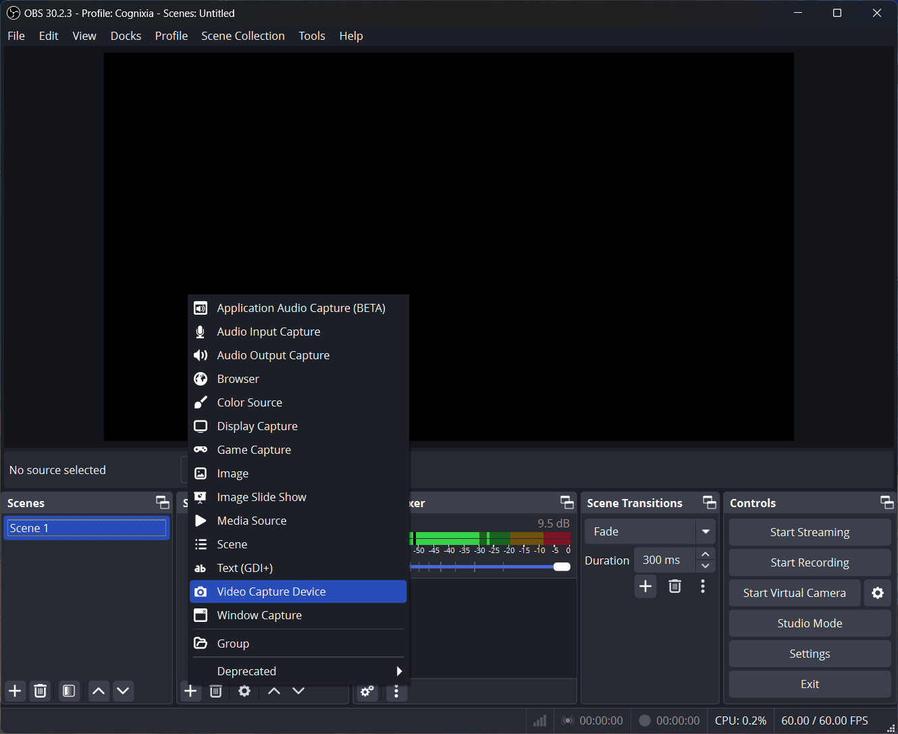

## Step 2: Add Filter
1. Add a filter to your video capture device by right clicking on the name of your video capture device and selecting `filters` (default is `Video Capture Device`). 

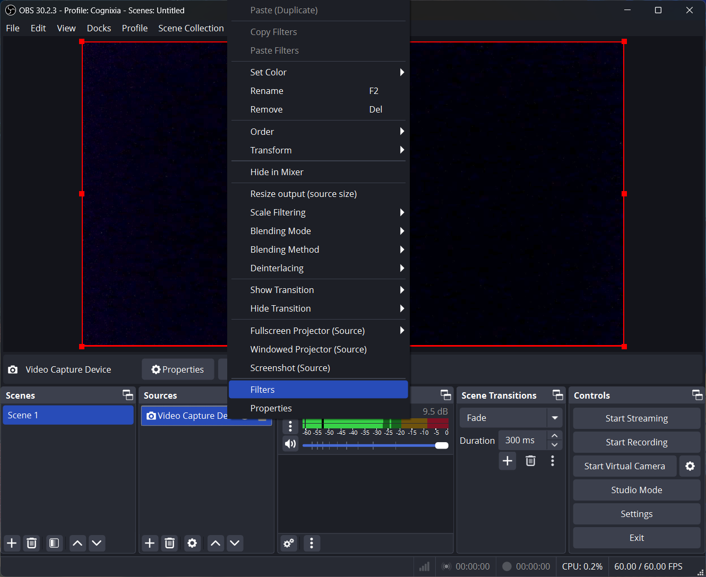

## Step 3: Choose Image Mask/Blend
1. Under `Effect Filters` choose `Image Mask/Blend`

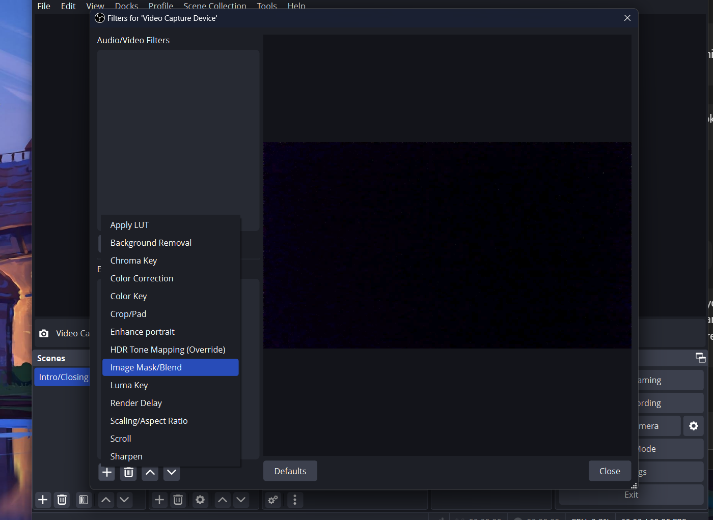

## Step 4: Add `OBS-MASK.png`
1. Keep all of the default values.
2. Select browse and find the location of `OBS-MASK.png`.
3. Select `close`.

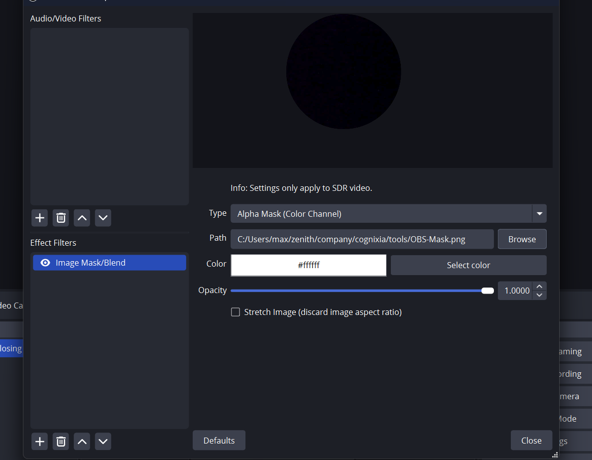

### Step 5: Add new `Window Capture`
1. Open UP your powerpoint template slide `goldeneye.pptx`.
2. Start Slide show.
3. Add new `Window Capture` to your sources.
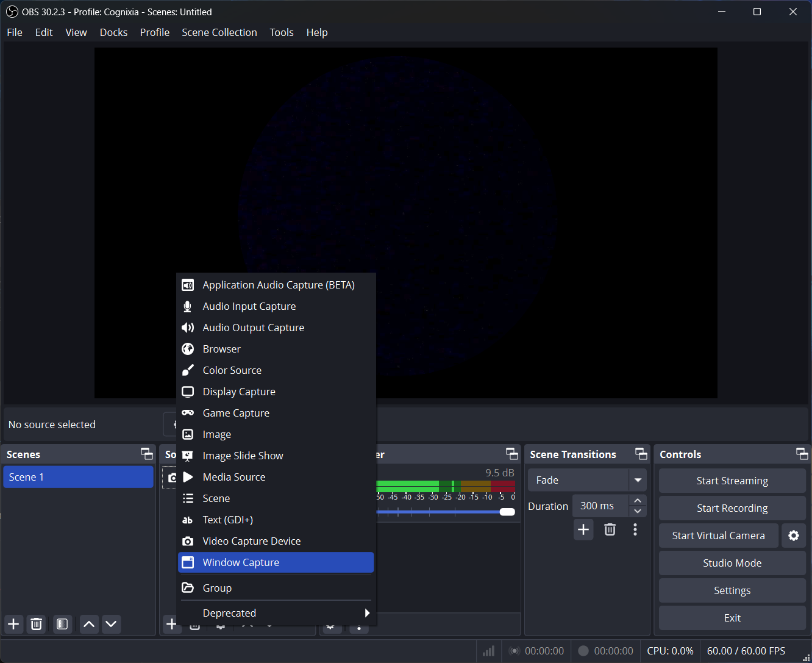

### Step 6: Select `PowerPoint Slide Show - goldeneye.pptx`
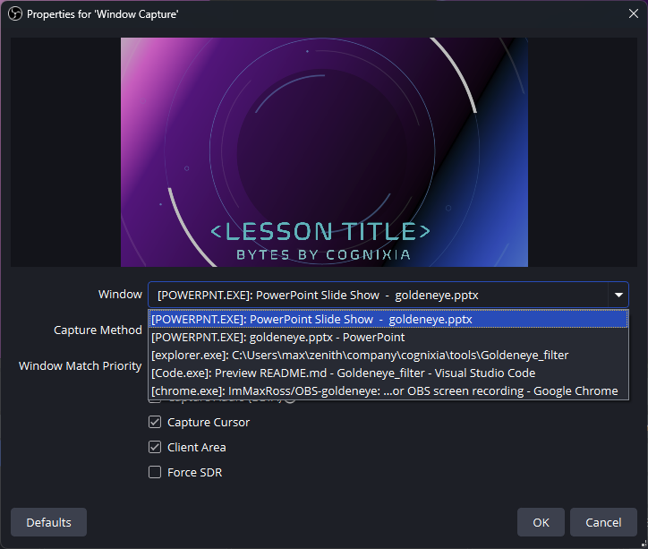

## Final Step: Select and drag `Window Capture` to underneath `Video Capture Device`
1. 

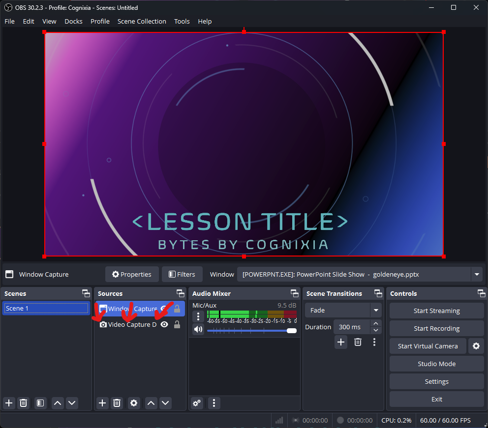

## Edit (if necessary)
1. You can **move the location** of your video image or **change the size** of your sources by selecting your `Video Capture Device` source and then clicking on the OBS screen page.
2. For more re-sizing troubleshooting, see the [Video Image Re-Sizing Guide](#video-image-re-sizing-if-necessary)

Just so we're synced up for now, here are the notes I shared with Max yesterday
 

## Zoom Recording Notes:
1. “When recording in Zoom, make sure to wait a few seconds at the beginning before you start speaking. This will help you edit out the media player overlay when recording in OBS”
2. “When recording in OBS, make sure to mute mic audio and only capture audio from your Zoom video playback. This will help avoid an echo effect”

___

### Video Image Re-Sizing (If Necessary)
If you want your head to appear larger or smaller inside of your image mask, follow the steps below:

## Step 1:
Reduce the size of your video capture device screen by:
1. `right clicking` on video preview screen.
2. select `Transform`
3. select `Edit Transform`

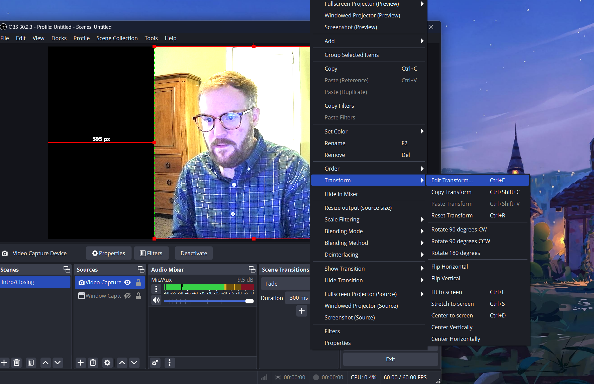

## Step 2:
1. Mess around with the crop settings until you've centered the filed of view on the outline of your shoulders. 
2. Click `close`

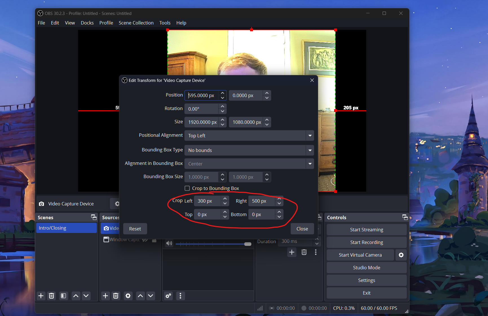

## Step 1:
1. Ensure that your camera is centered on your face, or the exact frame that you want to show up in the circle.
2. If your image is centered skip to Final Step
3. If you image is not centered:
    1. Go back to step `step 2` and mess around with the cropping to see if you can fix it that way.
    2. If you're not able to fix your image that way you'll have to edit the image mask itself. Shown in the next step.

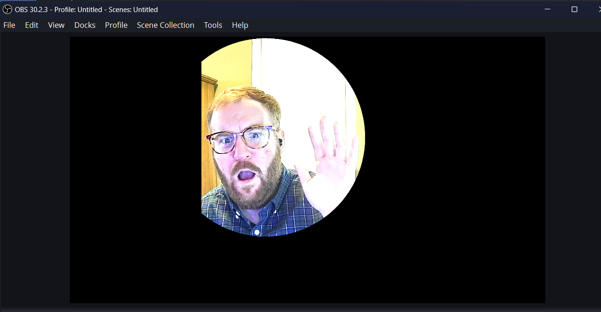

## Step 2: (troubleshooting cropped image mask)
1. Simply play around with the location and/or size of the white circle until you've centered your circle in OBS.
    1. If it's slightly cropped like shown in step 6 you should be able to take care of it in the edit transform, but if not you'll want to move it slightly to the opposite side of where the circle is being cut off from.

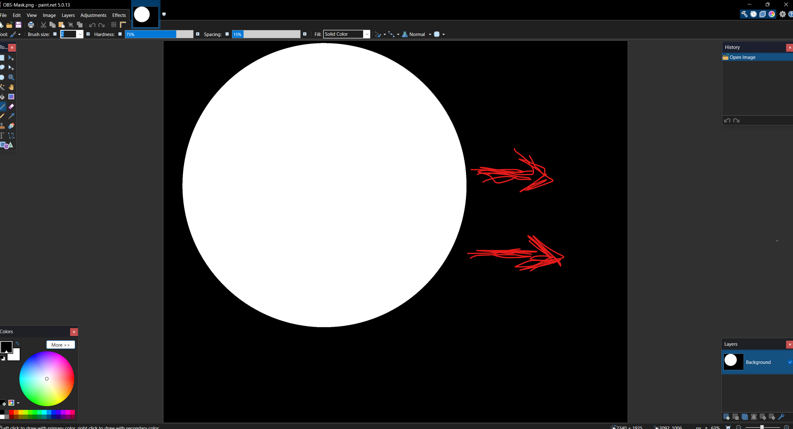

